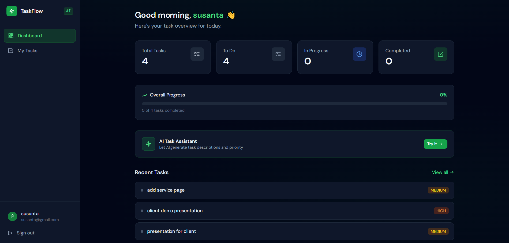
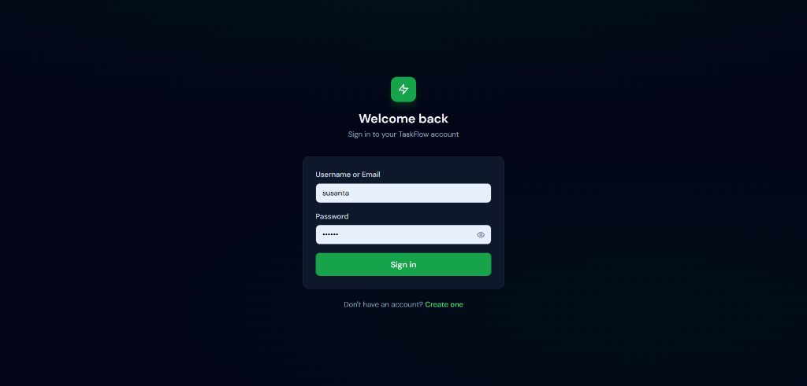
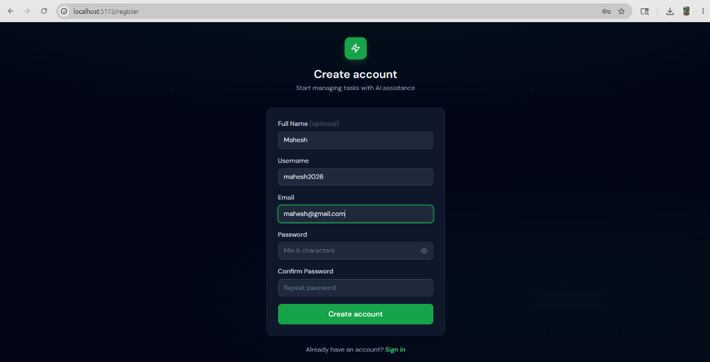
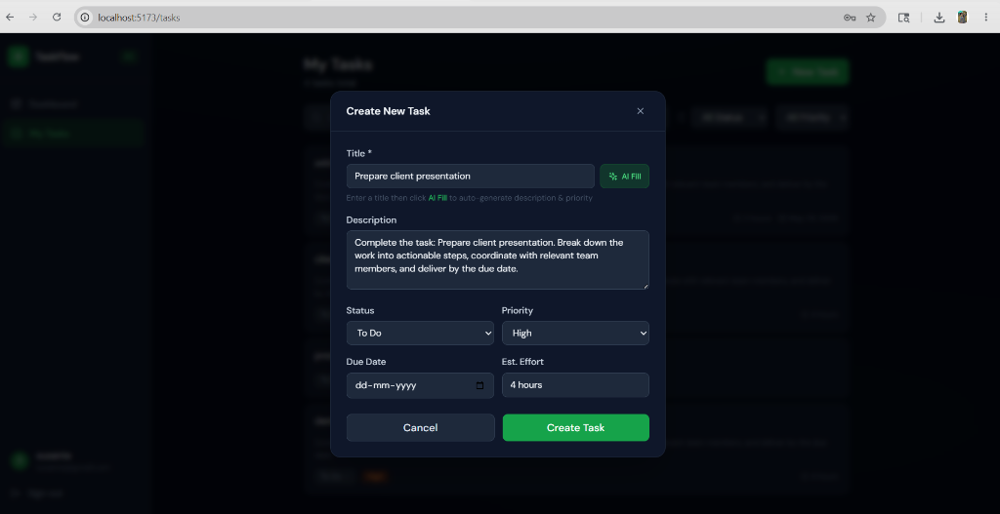

# TaskFlow — AI-Powered Task Management Portal

TaskFlow is a modern, full-stack task management application designed for seamless task organization and intelligent automation. It features a robust **Java 17 + Spring Boot 3.2** backend and a responsive **React + Vite + TypeScript + Tailwind CSS** frontend, integrated with the **Google Gemini Pro API** for cognitive task recommendations.

## 🔗 Live Demo
* **Frontend Portal (Vercel)**: [https://taskflow-silk-five.vercel.app](https://taskflow-silk-five.vercel.app)
* **Backend API (Render)**: [https://taskflow-backend-th9a.onrender.com](https://taskflow-backend-th9a.onrender.com)

---

## 📸 Screenshots

### 🖥️ Dashboard Overview


### 🔐 Authentication Flow
| Sign In | Sign Up |
| :---: | :---: |
|  |  |

### 🤖 Task Creation & AI Assistance


---

## 🚀 Tech Stack

| Layer | Technologies |
| :--- | :--- |
| **Backend** | Java 17, Spring Boot 3.2, Spring Security, JPA / Hibernate, WebFlux |
| **Frontend** | React 18, Vite, TypeScript, Tailwind CSS, Zustand, React Hook Form, Lucide Icons |
| **Database** | PostgreSQL (Production/Dev), H2 In-Memory (Test Suite) |
| **AI Integration** | Google Gemini API (WebClient) with a local rule-based fallback mechanism |
| **Authentication** | JSON Web Tokens (JWT) with secure local storage |

---

## ⚙️ Local Configuration & Setup

### Prerequisites
Make sure you have the following installed on your machine:
* **Java 17 LTS**
* **Maven 3.9+**
* **Node.js 18+**
* **PostgreSQL 14+** (Running and listening on port `5432`)

---

### 1. Database Setup
Create a PostgreSQL database named `taskflow`. You can do this via the PostgreSQL CLI:
```bash
psql -U postgres -c "CREATE DATABASE taskflow;"
```

### 2. Environment Configuration
Copy the `.env.example` file in the root directory to `.env`:
```bash
cp .env.example .env
```

Open [.env](file:///e:/taskflow/.env) and configure the variables:
```properties
# Database
DB_USERNAME=postgres
DB_PASSWORD=your_postgres_password

# JWT Settings
JWT_SECRET=your_super_long_random_jwt_secret_here_minimum_32_chars
JWT_EXPIRATION=86400000

# Google Gemini API (Get a free key from https://aistudio.google.com/)
GEMINI_API_KEY=your_gemini_api_key_here
```

---

## 🏃 Run the Application Locally

### Backend (Spring Boot)
Open a terminal in the `backend` directory. Set the database password and start the application:

**In PowerShell:**
```powershell
cd backend
$env:DB_PASSWORD="your_postgres_password"
$env:GEMINI_API_KEY="your_gemini_api_key_here"  # Optional
mvn spring-boot:run
```

**In Command Prompt (cmd):**
```cmd
cd backend
set DB_PASSWORD=your_postgres_password
set GEMINI_API_KEY=your_gemini_api_key_here  # Optional
mvn spring-boot:run
```

The API server will launch at **`http://localhost:8080`**.

### Frontend (React)
Open a separate terminal in the `frontend` directory, install dependencies, and start the Vite dev server:
```bash
cd frontend
npm install
npm run dev
```

The UI will be accessible at **`http://localhost:5173`** (proxied automatically to port 8080 for `/api` calls).

---

## 🧠 Cognitive AI Features (Gemini Pro)

TaskFlow incorporates a cognitive **AI Fill** system for creating tasks. When you enter a task title and click **AI Fill**, the system:
1. **With API Key**: Queries **Gemini Pro** using structured prompt engineering to generate a professional, context-rich task description, suggests task priority, and gives a realistic effort estimate.
2. **Without API Key (Intelligent Fallback)**: Runs local keyword-based heuristic models to suggest descriptions and estimates, ensuring the app remains fully functional off-grid.

---

## 🧪 Testing

Ensure everything is working correctly by running the test suites:

**Backend Tests:**
```bash
cd backend
mvn test
```

**Frontend Tests:**
```bash
cd frontend
npm test
```

---

## 📋 API Reference

### 🔐 Authentication (Public)
* `POST /api/auth/register` — Create a new account
* `POST /api/auth/login` — Sign in and receive a JWT token

### 📝 Task Management (Bearer Token Needed)
* `GET    /api/tasks` — List all user tasks (Supports query parameters: `status`, `priority`)
* `POST   /api/tasks` — Create a task
* `GET    /api/tasks/:id` — Retrieve task by ID
* `PUT    /api/tasks/:id` — Update task details
* `PATCH  /api/tasks/:id/status` — Quick-update task status
* `DELETE /api/tasks/:id` — Delete a task
* `GET    /api/tasks/stats` — Retrieve summary statistics of user tasks

### 🤖 AI Utilities (Bearer Token Needed)
* `POST /api/ai/generate` — Generate description + priority suggestion from task title
